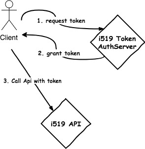

# I519 第三方支付API

## 總覽

此文件描述了所有i519對配合之商家之間資料交換的API。

所有通訊是透過 HTTP 並使用指定的 HTTP Method 來完成。Request 是 JSON 格式，內容類型都是 `application/json`。

## Base URL

```
https://{evn}.i519.com.tw/payment/
```

- `{evn}` 為環境參數： `test` 為測試環境, `cloud` 為正式環境。

## Token

Client 每次呼叫 i519 API 前, 必須取得 access token, 之後將 token 連同資料一起呼叫 API. 



每次核發的 token 時限為 30 秒, 時限內可不限次數的呼叫 i519 API,  超過時限則 client 必須重新取得 token.

### API

```
POST {baseUrl}/api/token
```

### Body

Reuest body 必須是 JSON 格式。下列為支援的欄位:

```json
{
	"channel": "<<註冊後由i519提供>>", 
	"client": "<<註冊後由i519提供>>", 
	"password": "<<註冊後由i519提供>>"
}
```

- `channel` - 用戶端通路代號
- `client` -  用戶端識別碼
- `password` - 密碼

### Output

```json
{
	"token": "generated-token"
}
```

- `token` - 核發 token

### HTTP Status Code

- 在取得 Token 過程中, 發生任何例外 (如 password 錯誤) 導致失敗, i519 將會回傳 `401`
- 在跟任何 API 串接時,   Client 傳入 Token 驗證失敗 (如 token 已過期), i519 也將回傳 `401`

## 資料上傳

### API

```
POST {baseUrl}/payment/api/details?t={token}
```

### Body

Reuest body 必須是 JSON 格式。下列為支援的欄位：

| Name | 名稱 | 說明 | 最大長度 | 必填 | 型態 |
|------|-----|---------|-----|------|-------|
| `channelCode` | 通路代號 | 註冊後由i519提供 | 50 | Y | C | |
| `mobile` | 消費者手機號碼 | | 12 | Y | C |
| `email` | 消費者email | | 50 | N | C |
| `payNo` | 交易序號 | 各商家可對應銷帳使用之號碼 (唯一不可重複) | 20 | Y | C |
| `payType` | 繳費模式 | `CSTORE`, `ATM`, `CCARD`, `eACH`, `EPAY` | 10 | Y | C |
| `collectAgc` | 超商選單 | `null`, 若payType選擇`CSTORE`才**可且需**填入: `IBON`, `FAMIPORT` | 10 | N | C |
| `payAmount` | 交易金額 | 數字，不包含 `-` | 10 | Y | I |
| `payExpiryDate` | 繳費期限 | `yyyy-MM-dd HH:mm[:ss]`。若payType=`ATM`，i519系統會自動將`HH:mm:ss`存成最後一刻 | 19 | Y | C |
| `remark` | 交易內容摘要 | | 255 | N | C |
| `username` | 經手人帳號 | 經手人(業績歸屬)之使用者帳號 | 50 | Y | C |
| `returnUrl` | 已繳費通知url | 客戶端系統用來接收已繳費通知的rul，若不帶此項或帶`null`則套用預設url | 255 | N | C |
| `bookPayNoticeDate` | 預約繳費簡訊發送日 | `yyyy-MM-dd` 授權扣款適用 | 10 | Y | C |

> 型態: `C`文字；`D`日期；`I`整數；`B`布林

```json
[{
  "channelCode": "a.test.channel.code",
  "mobile": "0988-888-888",
  "email": "support@i519.com.tw",
  "payNo": "A001",
  "payType": "CSTORE",
  "collectAgc": "FAMIPORT",
  "payAmount": 1000,
  "payExpiryDate": "2016-11-03 11:15",
   "username": "test"
}, {
	...
}]
```

### Output

| Name | 名稱 | 說明 |
|-----|------|------|
| `code` | 代碼 | |
| `result` | pinCode |新增的交易序號所對應的pinCode |
| `message` | 訊息array | 訊息補充說明 |


以 json 格式回傳

```json
{
 "code": "...",
 "result": [
        {
            "payNo": "...",
            "pinCode": "..."
        }
    ],
 "message": [
 		"...",
 		"..."
 	]
}
```

#### 訊息代碼清單

| Type | Code | 說明 | 問題描述 |
|------|------|------|--------|
| INFO | `I000` | 處理成功 | |
| ERROR | `E001` | 傳送資料無內文 | Input jsonData無內容 |
| ERROR | `E002` | 傳送資料格式錯誤 | Input jsonData中，任一欄位格式有誤 |
| ERROR | `E003` | 傳送資料內容錯誤 | 資料內容正確性驗證不通過 |
| ERROR | `E999` | 未知錯誤 | |

### 程式範例

貴公司開發人員可以參考以下程式碼, 但套用前請先調整`url`及`data`的內容:

```html
<!doctype html public "-//W3C//DTD HTML 4.0 Transitional//EN">
<html>
    <head>
        <script src="https://code.jquery.com/jquery-3.1.1.min.js" integrity="sha256-hVVnYaiADRTO2PzUGmuLJr8BLUSjGIZsDYGmIJLv2b8=" crossorigin="anonymous"></script>
    </head>

    <body>
        <button type="button"">Click to send data to i519</button>
        <script type="text/javascript">
            $("button").click(function(){
                $.ajax({
                    method: "POST",
                    url: "https://{evn}.i519.com.tw/payment/api/details",
                    contentType: "application/json; charset=UTF-8",
                    data: JSON.stringify([{
                          "channelCode": "a.test.channel.code",
                          "mobile": "0988-888-888",
                          "email": "support@i519.com.tw",
                          "payNo": "A001",
                          "payType": "CSTORE",
                          "collectAgc": "FAMIPORT",
                          "payAmount": 1000,
                          "payExpiryDate": "2017-11-03 11:15",
                          "username": "test"
                        }, {
                          "channelCode": "a.test.channel.code",
                          "mobile": "0988-888-888",
                          "email": "support@i519.com.tw",
                          "payNo": "A002",
                          "payType": "ATM",
                          "payAmount": 2000,
                          "payExpiryDate": "2017-11-03 11:15",
                          "username": "test"
                        }]),
                    dataType: "json"
                }).done(function(data, status, xhr){
                    console.log("response status code: " + xhr.status);
                    if (xhr.status !== 200) {
                        console.error("Something went wrong..");
                    }
                });
            });
        </script>
    </body>
</html>
```

## 已繳費通知

i519 在收到消費者有繳費動作後後，會以 POST 方式即時通知貴公司，該次繳費是成功還是失敗。總共會嘗試發送 3 次，每次間隔 60 秒。

### Body

Reuest body 會是 JSON 格式：

| Name | 名稱 | 說明 | 最大長度 | 型態 |
|------|-----|---------|-----|------|
| `pinCode` | 繳費代號 | | 20 | C |
| `payNo` | 交易序號 | | 20 | C |
| `payDate` | 繳費日期 | `yyyy-MM-ddTHH:mm:ss` | 19 | D |
| `paymentStatus` | 繳費狀態 | `UNPAID`, `PAID`, `OVERDUE`, `REFUND` | 7 | C |
| `payType` | 繳費模式 | `CSTORE`, `ATM`, `CCARD`, `EACH` | 6 | C | 
| `collectAgc` | 超商 | `IBON`, `FAMIPORT` (只有`payType=CSTORE`時此欄位才有值) | 8 | C | 
| `mobile` | 消費者手機號碼 | | 10 | C |
| `totalAmt` | 繳費金額 | | 7 | I |
| `code` | 訊息代碼 | | 4 | C |

> 型態: `C`文字；`D`日期；`I`整數；`B`布林

#### 訊息代碼

| Code | 說明 |
|------|-----|
| `I000` | 繳費成功 |
| `E001` | 無繳費代碼 |
| `E002` | 查無繳費資料 |
| `E003` | 繳費資料已過期 |
| `E004` | 重複繳費 |
| `E005` | 繳費資料已無效 |
| `E006` | 無繳費金額 |
| `E007` | 繳費金額超過限制 (五萬) |
| `E008` | 繳費金額與應繳金額不符 |
| `E999` | 未知錯誤 |

### 回傳狀態碼

貴公司處理完 Body 內容後，應依情況回傳 HTTP Status Code：

| Status Code | 定義 | 說明 |
|------|-----|---------|
| `200` | 成功 | |
| `其他` | 失敗 | |

### 測試方式

貴公司開發人員可以將以下程式碼修改`place.your.url.here `後，存儲成`.html`檔案，以瀏覽器開啟即可自己測試：

```html
<!doctype html public "-//W3C//DTD HTML 4.0 Transitional//EN">
<html>
	<head>
		<script src="https://code.jquery.com/jquery-3.1.1.min.js" integrity="sha256-hVVnYaiADRTO2PzUGmuLJr8BLUSjGIZsDYGmIJLv2b8=" crossorigin="anonymous"></script>
	</head>

	<body>
		<button type="button"">Click to mock nofity from i519</button>
		<script type="text/javascript">
			$("button").click(function(){
			    $.post("place.your.url.here",
			    {
			        pinCode: "0100LC0001",
			        payNo: "A00001",
			        payDate: "2016-12-31T17:46",
			        paymentStatus: "PAID",
			        payType: "CSTORE",
			        collectAgc: "FAMIPORT",
			        mobile: "0911222333",
			        totalAmt: 599,
			        code: "I000"
			    },
			    function(data, status, xhr){
			    	console.log("response status code: " + xhr.status);
			    	if (xhr.status !== 200) {
			    		console.error("Something went wrong..");
			    	}
			    });
			});
		</script>
	</body>
</html>
```

## 信用卡授權扣款簡訊發送
									      
### API

```
POST {baseUrl}/payment/api/ccardAuthMms?t={token}
```

### Body

Reuest body 必須是 JSON 格式。下列為支援的欄位：

| Name | 名稱 | 說明 | 最大長度 | 必填 | 型態 |
|------|-----|---------|-----|------|-------|
| `channelCode` | 通路代號 | 通路代號 | 50 | Y | C | |
| `mobile` | 扣款者手機號碼 | | 12 | Y | C |
| `effectiveDateTo` | 授權截止日 | `yyyy-MM-dd` | 10 | Y | C |
| `remark` | 授權扣款事項摘要 | | 255 | Y | C |
| `returnUrl` | 授權完成通知url | | 255 | N | C |

> 型態: `C`文字；`D`日期；`I`整數；`B`布林

```json
[{
  "channelCode": "a.test.channel.code",
  "mobile": "a.test.mobile",
  "effectiveDateTo": "a.test.expiry.date",
  "remark": "a.test.remark"
}, {
	...
}]
```

### Output

| Name | 名稱 | 說明 |
|-----|------|------|
| `code` | 代碼 | |
| `result` |  |無值 |
| `message` | 訊息array | 錯誤訊息補充說明 |


以 json 格式回傳

```json
{
 "code": "...",
 "result": [],
 "message": [
 		"...",
 		"..."
 	]
}
```

#### 訊息代碼清單

| Type | Code | 說明 | 問題描述 |
|------|------|------|--------|
| INFO | `I000` | 處理成功 | |
| ERROR | `E001` | 傳送資料無內文 | Input jsonData無內容 |
| ERROR | `E002` | 傳送資料格式錯誤 | Input jsonData中，任一欄位格式有誤 |
| ERROR | `E003` | 資料已過期 | token有誤或已過期 |
| ERROR | `E999` | 未知錯誤 | |


### 測試方式

貴公司開發人員可以將以下程式碼修改`place.your.url.here `後，存儲成`.html`檔案，以瀏覽器開啟即可自己測試：

```html
<!doctype html public "-//W3C//DTD HTML 4.0 Transitional//EN">
<html>
	<head>
		<script src="https://code.jquery.com/jquery-3.1.1.min.js" integrity="sha256-hVVnYaiADRTO2PzUGmuLJr8BLUSjGIZsDYGmIJLv2b8=" crossorigin="anonymous"></script>
	</head>

	<body>
		<button type="button"">Click to mock nofity from i519</button>
		<script type="text/javascript">
			$("button").click(function(){
			    $.post("place.your.url.here",
			    {
			        channelCode: "5190000000",
			        mobile: "0911222333",
			        applyDate: "2016-12-31T17:46",
			        effectiveDateTo: "2016-12-31",
			        remark: "REST test",
			        code: "I000"
			    },
			    function(data, status, xhr){
			    	console.log("response status code: " + xhr.status);
			    	if (xhr.status !== 200) {
			    		console.error("Something went wrong..");
			    	}
			    });
			});
		</script>
	</body>
</html>
```


## 接收交易結果(只適用於EPAY)

### API

```
POST {baseUrl}/payment/api/payback?t={token}
```

### Body

Reuest body 必須是 JSON 格式。下列為支援的欄位：

| Name | 名稱 | 說明 | 最大長度 | 必填 | 型態 |
|------|-----|---------|-----|------|-------|
| `channelCode` | 通路代號 | 註冊後由i519提供 | 50 | Y | C | |
| `mobile` | 消費者手機號碼 | | 12 | Y | C |
| `payNo` | 交易序號 | 各商家可對應銷帳使用之號碼 (唯一不可重複) | 20 | Y | C |
| `payType` | 繳費模式 |  `EPAY` | 10 | Y | C |
| `collectAgc` | 代收機構 | `null`, 若payType選擇`EPAY`才**可且需**填入: `EZWallet`, `LPM`, `JKO` | 10 | N | C |
| `payAmount` | 交易金額 | 數字，不包含 `-` | 10 | Y | I |
| `payExpiryDate` | 繳費期限 | `yyyy-MM-dd HH:mm[:ss]`| 19 | Y | C |
| `remark` | 交易內容摘要 | 可將ID回寫(第一碼英文+末3碼)| 255 | N | C | 
| `paymentStatus` | 繳費狀態 | `UNPAID`, `PAID`| 50 | Y | C |
| `payDate` | 繳費日期 | `yyyy-MM-dd HH:mm:ss`| 19 | Y | C |

> 型態: `C`文字；`D`日期；`I`整數；`B`布林

```json
[{
  "channelCode": "a.test.channel.code",
  "mobile": "0988-888-888", 
  "payNo": "A001",
  "payType": "EPAY",
  "collectAgc": "EZWallet",
  "payAmount": 1000,
  "payExpiryDate": "2016-11-03 11:15",
  "remark": "A789",
  "paymentStatus": "PAID",
  "payDate": "2016-11-03 11:15:23"
}, {
	...
}]
```

### Output

| Name | 名稱 | 說明 |
|-----|------|------|
| `code` | 代碼 | |
| `result` | payNo | |
| `message` | 訊息array | 訊息補充說明 |


以 json 格式回傳

```json
{
 "code": "...",
 "result": [
        {
            "payNo": "..."
        }
    ],
 "message": [
 		"...",
 		"..."
 	]
}
```

#### 訊息代碼清單

| Type | Code | 說明 | 問題描述 |
|------|------|------|--------|
| INFO | `I000` | 處理成功 | |
| ERROR | `E001` | 傳送資料無內文 | Input jsonData無內容 |
| ERROR | `E002` | 傳送資料格式錯誤 | Input jsonData中，任一欄位格式有誤 |
| ERROR | `E003` | 傳送資料內容錯誤 | 資料內容正確性驗證不通過 |
| ERROR | `E999` | 未知錯誤 | |
